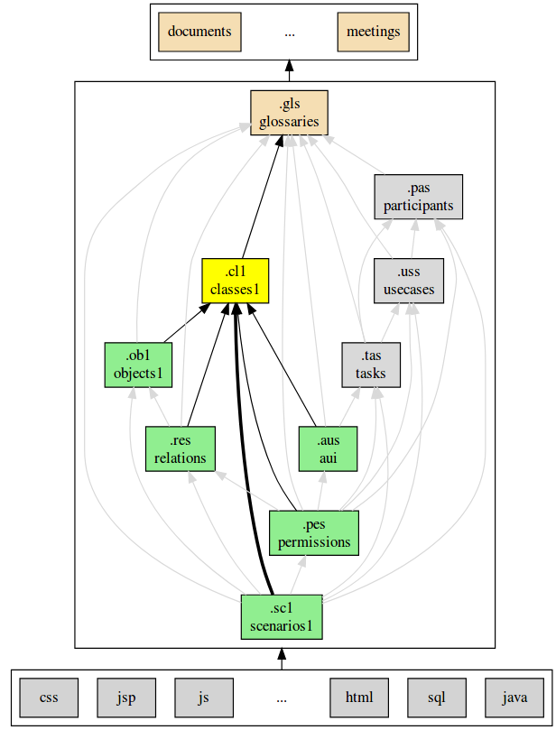

.. .. coding=utf-8

.. highlight:: ClassScript1

.. index:: ! .cl1, ! ClassScript1
   single: Script ; ClassScript1

.. _ClassScript1:

ClassScript1
============

Exemples
--------

..  note::
    L'exemple suivant n'a strictement aucun sens. Il est juste fourni
    ici pour donner une idée de la syntaxe de ClassScript1.

..  code-block:: ClassScript1

    --@ class model Jungle
    --@ import glossary model from "../glossaries/glossaries.gls"

    model Jungle

    enum Season {
        spring,
        summer
    }

    class Yellow
    end

    class Banana < Yellow
        --| A Banana is a nice Fruit that growths
        --| in the forest.
        attributes
            _name_ : String --@ {id} {derived} {optional}
            length : Integer
                --| the length of the banana expressed in milimeters.
            size : Real
            frozen : Boolean
            expirationDate: String --@ {Date}
            growthTime : Season
    end

    association Owns
        --| A person owns some cars if he or she
        --| bought it and didn't sell it.
        between
            Person [1] role owner
            Car[*] role properties
                --| A person can have several
                --| properties if he or she's lucky
    end

    associationclass Hate
        between
            Monkey [*] role monkeys
            Snake [*] role snakes
        attributes
            reason : String
            intensity : Integer
    end

    constraints

    --@ constraint SmallBananas
    --@     scope
    --@         Banana.size
    --@         Banana.length
    --@     | Bananas are longer than their length.

            context self : Banana inv SmallBananas :
            self.size > self.length

    --@ constraint MomentConcerne
    --@     scope
    --@         Atelier.dateDeDebut
    --@         Atelier.dateDeFin
    --@         Concerne
    --@         Emprunt.dateDeSortie
    --@     | Si un emprunt <e> concerne un atelier <a> alors cet
    --@     | emprunt <e> a eu lieu dans la période 
 correspondant
    --@     | à l'atelier <a>.

ClassScript1
------------

*ClassScript* est un langage textuel pour les `diagrammes de classes UML`_.
Dans la version de ModelScript le langage ``ClassScript1`` est en fait
une version augmentée d'un sous ensemble du langage `USE OCL`_.
ClassScript1 diffère très légèrement de `USE OCL`_:

*   annotations. Deux types d'annotations sont ajoutées sous forme de
    commentaire USE OCL :

    *   ``--|`` préfixe la documentation ModelScript.
    *   ``--@`` préfixe les autres annotations ModelScript.

*   restrictions: ClassScript1 ne prend pas en compte les associations
    qualifièes et les autres fonctionnalités telles que les
    post-conditions et les post-conditions.

Alors que l'extension ``.use`` est utilisée dans le cadre de `USE OCL`_,
ici ``.cl1`` est l'extension des scripts ClassScripts1.

Outils
------

Analyse de modèles
''''''''''''''''''

Les modèles ClassScript1 peuvent être utilisés avec l'outil `USE OCL`_.
Quand la :ref:`méthode ModelScript<ModelScriptMethod>` est utilisée
la ligne de commande suivante permet de "compiler" le modèle de classes
(en supposant que le répertoire courant est le répertoire racine du
projet de modèlisation) :

..  code-block:: none

       use -c concepts/classes/classes.cl1

L'interpréteur vérifie si il y a des erreurs ou non. Ce peut être
des erreurs de syntaxe, des erreurs de types, des contraintes violées, etc.
Si aucune erreur n'est affichée alors le modèle de classes est correct.

Génération de diagrammes
''''''''''''''''''''''''

Dessiner un diagramme de classes UML est possible avec l'outil `USE OCL`_.

..  code-block:: none

    use -nr concepts/classes/classes.cl1

Voir la page "`créer un diagramme de classes UML`_" pour plus d'information.

Quand la :ref:`méthode ModelScript<ModelScriptMethod>` est utilisée
le fichier de "layout" de USE OCL (la disposition des classes) doit être
sauvegardé dans le fichier ``concepts/classes/diagrammes/classes.cld.clt``.
Un copie d'écran du diagramme doit être réalisée et il s'agit de remplacer
le fichier ``concepts/classes/diagrammes/classes.cld.png``.

Concepts
--------

Un modèle de classes est basé sur les concepts suivants :

* énumérations,
* classes,
* attributs,
* associations,
* classes associatives,
* contraintes.

Enumérations
------------

..  code-block:: ClassScript1

    enum Season {
        --| Documentation of the enumeration
        --| Explains what is a season.
        winter,
            --| Documentation of the
            --| winter value
        autumn,
            --| Documentation of the autumn value
        spring,
        summer
    }

Classes
-------

Diagramme de classes UML:

..  image:: media/USEOCLClasses.png
    :align: center

ClassScript1 (basé sur USE OCL):

..  code-block:: ClassScript1

    class Yellow
        --| Documentation of the
        --| yellow class
    end

    abstract class Something
        --| Something is an abstract class
    end

    abstract class Fruit < Something
        --| Fruits are particular cases of Something
    end

    class Banana < Fruit, Yellow
        --| Bananas are both fruits and
        --| yellow things.
    end

Attributs
---------

ClassScript1 (basé sur USE OCL):

..  code-block:: ClassScript1

    class Banana
        --| A Banana is a nice Fruit that growths
        --| in the forest.
        attributes
            _name_ : String --@ {id} {derived} {optional}
                --| A banana always have nice names.
            length : Integer
                --| The length of the banana
                --| is between 5 and 40
            size : Real
            frozen : Boolean
            expirationDate: String --@ {Date}
            growthTime : Season
            remainingDays : Integer
    end

:Attribute types:

    Les attributs peuvent avoir les types suivants (lire la note sur
    les Dates pour plus de détails) :

    *   ``Boolean``,
    *   ``Integer``,
    *   ``Real``,
    *   ``String``,
    *   ``Date``,
    *   ``DateTme``,
    *   ``Time``,
    *   une énumération.

:Dates:

    Les types ``Date``, ``DateTime`` et ``Time`` n'existent pas en `USE OCL`_.
    Les attributs de ces types doivent donc être défini comme étant de type
    ``String`` et les annotations ``{Date}``, ``{DateTime}`` or ``{Time}``
    doivent être ajoutées dans le code (voir l'exemple ci-dessus).
    La valeur de ces attributs doivent être représentés comme suit :
    ``2020/12/23`` pour les valeurs dy type Date, ``2020/12/23-23:50:59``
    pour DateTime, and ``23:00:32`` pour Time. Ce format permet les
    comparaisons. Les autres opérations ne sont pas possibles.

Associations
------------

UML class diagram:

..  image:: media/USEOCLAssociationUSE.png
    :align: center

ClassScript1 (basé sur USE OCL):

..  code-block:: ClassScript1

    association Owns
        --| A person owns some cars if he or she *
        --| bought it and didn't sell it.
        between
            Person [1] role owner
            Car[*] role properties
                --| A person can have several
                --| properties if he or she's lucky
    end

Notons que l'ordre des roles est important. Dans l'exemple ci-dessus
l'association se lit  "(an) owner Owns (some) ownedCars" : le premier
rôle est le sujet de la phrase ; le second rôle est le complément.
L'ordre des rôles est également important pour la création des liens
dans les diagrammes d'objets.

Association Classes
-------------------

UML Diagram:

..  image:: media/USEOCLAssociationClassUSE.png
    :align: center

ClassScript1 (basé sur USE OCL):

..  code-block:: ClassScript1

    associationclass Hate
        --| Some monkeys hate some snakes.
        --| That's life. Life in the jungle.
        between
            Monkey [*] role monkeys
            Snake [*] role snakes
        attributes
            reason : String
            intensity : Integer
    end

Contraintes
-----------

`USE OCL`_ permet l'écriture de 3 types de contraintes : invariant,
pré-conditions et post-conditions. Par contre ClassScript1 est basé sur
l'utilisation d'invariants uniquement. Par abus de language
on utilisera de manière interchangeable les termes "contrainte" et
"invariant".

En ClassScript1 les contraintes (invariants) peuvent être définies
en langage naturel en respectant toutefois un certain format.
Ces contraintes peuvent ensuite être décrites en langage OCL.

..  _ClassScript_contraintes_ln:

Contraintes en Langage Naturel (LN)
'''''''''''''''''''''''''''''''''''

Ecrire les contraintes en Langue Naturelle (LN) est une étape indispensable
avant de formaliser ces contraintes en OCL. C'est en effet le client
qui exprime ces contraintes, ou tout au moins qui les valide.

Structure
.........

Chaque contrainte doit comporter les éléments suivants :

*   un **identificateur** (p.e. ``FormatMotDePasse``),

*   une **portée** d'application (mot clé ``scope``), c'est à dire la
    partie du diagramme de classes qui permet d'expliquer
    "où se trouve" la contrainte.
    La zone est représentée par une liste de noms de :

    * **classes** (p.e. ``Personne``),
    * **associations** (p.e. ``Concerne``),
    * **attributs** (p.e. ``Personne.nom``),
    * **roles** (p.e. ``Personne.parents``).

*   une **description** en langue naturelle. Idéalement la description
    doit pouvoir être lue par le "client' aussi bien que par les
    développeurs. La description doit à la fois faire référence au
    glossaire, mais également autant
    que possible aux identificateurs se trouvant dans le diagramme. La
    correspondance entre les éléments décrivant la portée du modèle doit
    être claire et non ambigüe.

Exemple
.......

Dans cet exemple la contrainte est un invariant. Ce code est à ajouter
à la fin du modèle de classes (à la fin du fichier ``classes.cl1``).

..  code-block:: ClassScript1

    --@ invariant MomentConcerne
    --@     scope
    --@         Atelier.dateDeDebut
    --@         Atelier.dateDeFin
    --@         Concerne
    --@         Emprunt.dateDeSortie
    --@     | Si un emprunt concerne un atelier alors cet
    --@     | emprunt a eu lieu dans la période correspondant à
    --@     | l'atelier.

Dans l'exemple ci-dessus la notion de période n'est pas nécessairement
claire et la locution "a eu lieu" non plus. Il est possible de préciser
la phrase comme ci-dessous. Par ailleurs ci-dessous l'utilisation de
variables a été ajoutée sous forme de "marqueurs". Il s'agit donc
de langue naturelle "marquée". Ces variables ne sont pas nécessaires
dans cet exemple mais elles peuvent être utiles avec des phrases
plus complexes. Elles peuvent également se réveler utiles pour guider
d'une part l'implementation de la contrainte et d'autre par l'écriture
des tests positifs et négatifs.

..  code-block:: ClassScript1

    --@     | Si un emprunt <e> concerne un atelier <a> alors
    --@     | la date de sortie de l'emprunt <e> eu lieu entre la date de
    --@     | début <dd> de l'atelier <a> et sa date de fin <df>.

..  _ClassScript_contraintes_methode:

Méthode
.......

Trouver les contraintes à définir peut s'avérer difficile dans le cas
de problèmes complexes. L'une des techniques possibles est de passer un
à un les différents éléments d'un modèle de classes. Il s'agit ainsi de
lister les contraintes portant sur :

*   **un attribut**, typiquement les contraintes de domaine (e.g. *age>0*)

*   **plusieurs attributs** d'une classe (e.g. ``min<=max``)

*   **une association** (e.g. *le père d'une personne 
 est plus agé*)

*   **plusieurs associations** (e.g. *le salaire d'une personne employée
    dans une entreprise ne peut pas être supérieur à 5% du budget du projet
    sur lequel elle travaille, sauf si elle est classée A*).

Par ailleurs lorsque plusieurs associations forment un cycle il assez
probable qu'une ou des contraintes s'appliquent au sein de ce périmètre.

Constraintes OCL
''''''''''''''''

Les contraintes exprimées en langage naturel (voir ci-dessus) peuvent
ensuite être traduites en OCL en utilisant `USE OCL`_

Dépendances
-----------

Le graphe ci-dessous montre les dépendances entre langages.

..  _`USE OCL`: https://scribestools.readthedocs.io/en/latest/useocl/index.html

.. _`diagrammes de classes UML`: https://www.uml-diagrams.org/class-diagrams-overview.html

.. _`créer un diagramme de classes UML`: http://scribetools.readthedocs.io/en/latest/useocl/index.html#creating-diagrams
