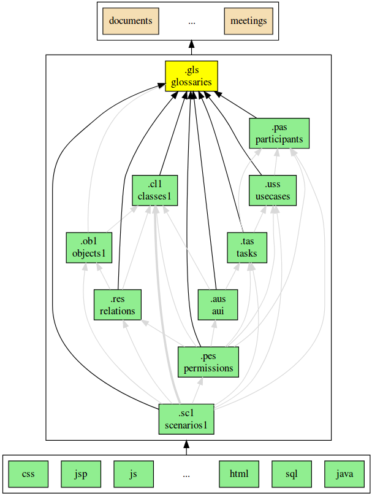

.. .. coding=utf-8

.. highlight:: GlossaryScript

.. index::  ! .gls, ! GlossaryScript
    pair: Script ; GlossaryScript

.. _GlossaryScript:

GlossaryScript
==============

Exemples
--------

L'exemple ci-dessous n'a aucun sens. Il est seulement utilisé
pour illustrer la syntaxe du langage GlossaryScript.

..  note::

    Le glossaire fourni ci-dessous n'est pas complet. Certaines
    définitions sont manquantes bien qu'elles soient référencées.

..  code-block:: GlossaryScript

    glossary model Medium
        | `Description` de `un` élément
        | dans `un` contexte `uno` et `deux`
        | `un` `test`


    //------------------------------------------------------------
    //   Glossaire du domaine
    //------------------------------------------------------------

    package GlossaireDuDomaine

    FilDeDiscussion
        | Suite ordonnée de `Messages`
        synonyms: Uno One
        inflections: unite uns
        texts:
            fr: "Fil de discussion"
            en: "Thread"

    Reference
        | Mot ou suite de mots faisant référence à
        | un `Concept` déjà défini. Attention à l'`Indentation`
        | qui doit être toujours de `huit` espaces.
        synonyms : a b c

    //------------------------------------------------------------
    //   Glossaire technique
    //------------------------------------------------------------

    package GlossaireTechnique

    MVC
        | Patron de conception utilisé lors de la définition
        | d'interface homme machine.
        | Voir https://en.wikipedia.org/wiki/Model%E2%80%93view%E2%80%93controller
        | In the context of this project ...

GlossaryScript
--------------

Le langage ``GlossaryScript``, tel que défini ci-dessus par l'exemple,
permet d'exprimer des *glossaires*. Plusieurs glossaires peuvent
être défini dans un même modèle. Par exemple il est possible de définir
un glossaire de domaine bancaire et à coté de cela un glossaire technique
définissant les termes de J2EE. Tous les glossaires sont définis dans
le même fichier. La notion de paquetage (packages) permet de séparer ce
fichier en plusieurs glossaires.
Les scripts GlossaryScript ont l'extension ``.gls``.

.. index:: ! Glossary


Concepts
--------

Un **glossaire** est une collection d'**entrées** optionnellement
organisée en **paquetages**. Le but d'un glossaire est de définir
tous les **termes** utilisés dans le contexte d'un projet donné.

Un **glossaire** est composé de :

*   un ensemble d'**entrées** composé d'un **terme principal**
    ainsi que de **termes alternatifs** (**synonymes**,
    **abbréviations**, etc.),

*   la définition des relations entre ces différents termes,

*   une définition pour chaque entrée, définition pouvant faire
    référence aux différents termes du glossaire.

.. index:: ! Entry
    single: Term
    single: Term; Main term (term)

Entrées
-------

Une **entrée** est essentiellement :

*   un **terme principal** (p.e. ``Fil`` dans l'exemple ci-dessous)

*   un ensemble de **termes alternatifs** (**synonymes**, **abbréviations**,
    etc.)

*   une **définition** qui correspond bien à l'ensemble des termes,

*   un ensemble optionnel de **traductions** définissant pour différents
    **langages** la représentation concrète de l'entrée.

..  code-block:: GlossaryScript

    Fil
        | Séquence de `Messages` en réponse à un `Initial`. Un fil
        | peut être `Bloque` ou `Ouvert` et est identifié par
        | un `Theme` et un ensemble de `Cles`.
        synonyms: Discussion, FilDeDiscussion
        inflections: Fils
        translations
            fr: "fil de discussion"
            en: "thread"
            es: "conversacion"
    ...

Le **terme principal** (``Fil`` ici) est celui sensé être référencé :

*   dans le reste du glossaire,

*   et dans les textes techniques lorsque ceux-ci sont réécrits avec le
    glossaire.

..  note::

    Un même mot peut parfois avoir plusieurs acceptions (plusieurs
    significations). Si c'est le cas numéroter les termes principaux pour
    chaque acception. Par exemple ``Fil1`` et ``Fil2`` peuvent
    correspondre à deux acceptions du mot Fil. Les différentes occurrences
    du mot Fil dans les différents textes devront bien évidemment être
    remplacées par ``Fil1`` ou ``Fil2`` .

.. index::
    single: Synonym
    single: Term; Synonym (term)

Synonymes
'''''''''

Plusieurs synonymes peuvent être associés à une entrée :

..  code-block:: GlossaryScript

    Fil
        | Définition
        | ...
        synonyms: Discussion, FilDeDiscussion

Les **synonymes** sont des termes qui ont la même signification que
le terme principal. Par exemple dans l'exemple ci-dessus
``Discussion`` et ``Fil`` ont la même signification, mais ``Fil`` est le
terme principal. Cela signifie que toutes les occurrences de ``Discussion``
dans les textes devraient être remplacées par ``Fil``.

.. index:: Inflection
    single: Term ; Inflection (term)


Inflexions
''''''''''
Les **inflexions** sont des dérivations du terme principal, tel que
pluriels, formes avec des genres différents, formes verbales vs.
nominales, conjugaisons, etc.

..  code-block:: GlossaryScript

    Fil
        | Définition
        | ...
        inflections: Fils

Au contraire des synonymes les inflexions sont des variations "normales"
du terme principal et ne sont pas supposées être remplacé par celui-ci.

.. index:: Translation
    single: Term ; Translation (term)

Traductions
'''''''''''
Alors qu'une entrée est définie par son terme principal, cette entrée peut
posséder plusieurs **traductions**. Chaque traduction est définie par :

* la langue utilisée pour la traduction (encodée en iso-639),
* la chaîne de caractères correspondant à la traduction.

..  code-block:: GlossaryScript

    Fil
        translations
            fr: "fil de discussion"
            en: "thread"
            es: "conversacion"


.. index:: Package

Paquetages
----------

Un ensemble d'entrées peut être scindé en plusieurs **paquetages** en
utilisant le mot clé ``package`` suivi du nom de paquetage. Deux
possibilités sont offertes par ModelScript : (1) utiliser le mot clé de
manière globale suivi d'un ensemble d'entrées, ou (2) d'indiquer pour
chaque entrée le paquetage à laquelle elle appartient.

.. index::
    single: Package; Toplevel package
    single: Toplevel package

Paquetages globaux
''''''''''''''''''

Toutes les entrées entre un mot clé ``package`` et le suivant sont
rangées dans ce paquetage. De plus toutes les entrées avant le premier
mot clé ``package`` font partie du paquetage ``unamed``.

..  note::
    Pour éviter une indentation supplémentaire les entrées et les
    paquetages sont définis au même niveau.

..  code-block:: GlossaryScript

    glossary model CyberForum


    //------------------------------------------------------------
    //   Glossaire du domaine
    //------------------------------------------------------------

    package GlossaireDuDomaine

    Forum
        ...
    Fil
        ...
    ...

    //------------------------------------------------------------
    //   Glossaire technique
    //------------------------------------------------------------

    package GlossaireTechnique

    MVC
        | Patron de conception utilisé lors de la définition
        | d'interface homme machine.

    ...

.. index::
    single: Package; Inline package
    single: Inline package

Paquetages en ligne
'''''''''''''''''''

Une entrée peut être à n'importe quel moment associée à un
paquetage particulier, existant ou non. Il suffit d'utiliser pour
cela le mot clé ``package`` à l'intérieur de l'entrée ; voir
par exemple ``Numbers`` ci-dessous :

..  code-block:: GlossaryScript

    ...
    package Letters              // Toplevel package

    Alpha

    One
        package: Numbers         // Inline package

    Beta


.. _GlossaryScript_Regles:

Règles
------

Les règles suivantes doivent être appliquées dans l'élaboration
des glossaires :

*   Dans les définitions, les références à d'autres termes du
    glossaire doivent être entre backquotes (p.e. ```Backquote```).
    Ces termes doivent être définis.

*   Dans les textes les mots sans ```Backquote``` font référence
    aux mots du dictionnaire. Les deux peuvent cohéxister.

*   Les définitions doivent normallement commencer par une forme nominale,
    tout comme dans un dictionnaire. La définition
    ``"Singe : Animal ...`` est adaptée. Le premier terme ("Animal" ici)
    peut faire partie du glossaire entre backquotes ou être un terme
    d'usage courant (sans backquotes).

*   Toutes les définitions doivent correspondre au contexte
    particulier du projet. Omettre les définitions générales.
    Par exemple "Personne : Etre humain" n'apporte rien si le terme
    "Personne" n'a pas de signification différente de "personne" d'usage
    courant. Mettre "Personne" dans le glossaire s'il s'agit d'un
    terme spécifique au projet.

.. _GlossaryScript_Reecriture:

Réécriture de textes
--------------------

Au fur et à mesure qu'un glossaire est défini, il faut réécrire les
textes utilisant "informellement" le glossaire. En pratique pour chaque
terme apparaissant dans un texte il faut déterminer s'il s'agit :

*   d'un terme d'usage général : aucune action n'est nécessaire.

*   d'un terme du domaine mais non défini : l'ajouter au glossaire.

*   d'un terme déjà défini comme terme principal dans le glossaire.
    il faut alors créer une référence (entre backquotes) vers ce terme.

*   d'un synonyme déjà défini : il faut le remplacer par le terme
    principal entre .

Ce travail de réécriture / définition du glossaire est bien évidemment
itératif. L'objectif final est d'obtenir des textes les moins ambigüs
et plus cohérents possible avec le glossaire.


.. _GlossaryScript_ReecritureDIdentificateurs:

Réécriture des identificateurs
------------------------------

La plupart des identificateurs (UML, Class, Java, SQL, etc.) devraient
faire référence à un ou plusieurs termes d'un glossaire du domaine
et/ou technique. C'est le cas par exemple pour l'identificateur suivant :

    getCartLayout

Le terme ``Cart`` provient sans doute du glossaire du domaine alors que
``Layout`` peut provenir d'un domaine technique correpondant à un
framework utilisé.

Dans certains cas des abbréviations sont utilisées pour obtenir des
identificateurs plus courts. Celles-ci doivent être ajoutées dans le
glossaire technique (p.e. ``DAO``) ou dans le glossaire de domaine
(``num`` pour ``numéro``). Le glossaire doit assurer l'usage des termes
de manière homogéne et consistante dans tous les modèles et dans tout
le code.

Un identificateur qui ne fait référence ni au domaine ni aux
aspects techniques est sujet à suspicion.

Dans tous les cas il est fondamental, lorsque les glossaires changent
ou lorsque de nouveaux identificateurs sont définis, de s'assurer de
l'alignement entre glossaire et les autres artefacts.

Dépendances
-----------

Le graphe ci-dessous montrent les dépendances entre langages et en
particulier avec le glossaire. Comme on peut le voir le glossaire
dépend de tous les éléments issus de la capture des besoins.
Le glossaire est en fait extrait des différents documents existants.
Dans la direction opposée tous les modèles dépendent du glossaire
dans la mesure où tous ces modèles peuvent avoir de la documentation
et sont certainement basés sur des identificateurs.


