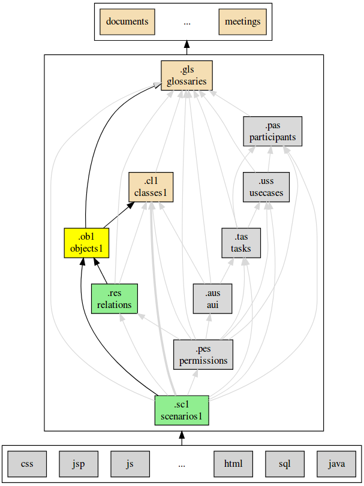

.. .. coding=utf-8

.. highlight:: ObjectScript1

.. index::  ! .obs, ! ObjectScript1
    pair: Script ; ObjectScript1

.. _ObjectScript1:

ObjectScript1
=============

Examples
--------

The following code shows a raw object model:

..  code-block:: ObjectScript1

    ! create bob : Personne
    ! bob.nom := 'bob'
    ! bob.age := 37
    ! insert(bob, c232) into EstResponsableDe
    ! create nourry : Enseignant
    ! nourry.nom := 'Nourry Blanc'
    ! nourry.matiere := 'musique'
    ! nourry.login := Undefined
    ! nourry.motDePasse := Undefined
    ! create s876 : Classe
    ! s876.code := 'S876'
    ! insert (nourry, s876) into IntervientDans

The following code shows an annotated object model:

..  code-block:: ObjectScript1

    --| (1) Bob a 37 ans et est responsable de la classe c232
        ! create bob : Personne
        ! bob.nom := 'bob'
        ! bob.age := 37
        ! insert(bob, c232) into EstResponsableDe
    --| (2) Nourry Blanc est professeur de musique.
        ! create nourry : Enseignant
        ! nourry.nom := 'Nourry Blanc'
        ! nourry.matiere := 'musique'
        ! nourry.login := Undefined
        ! nourry.motDePasse := Undefined
    --| (3) Nourry Blanc intervient en terminale S876.
    --| (4) Il a vraiment de la chance.
    --| (5) La terminale S876 est plaisante.
        ! create s876 : Classe
        ! s876.code := 'S876'
        ! insert (nourry, s876) into IntervientDans
    --| (6) Alicia Ganto est professeur de math.

The following code shows a negative object model:

..  code-block:: ObjectScript1

    --@ violates EstResponsableDe.responsable.max
    --@ violates ResponsableAdulte

    --| (1) Bob a 30 ans et est responsable de la classe c232
        ! create bob : Personne
        ! bob.age := 30
        ! insert(bob, c232) into EstResponsableDe
    --| (2) Octavia a 17 ans et est responsable la classe c232.
        ! create octavia : Personne
        ! octavia.age := 17
        ! insert(bob, c232) into EstResponsableDe

ObjectScript1
-------------

"ObjectScript1" is a textual notation for UML `object diagrams`_.
Object script is a restricted version of the `USE OCL`_
SOIL language. In the context of `USE OCL`_ the
``.soil`` extension is usually  used, but here the ``.ob1`` is used
for object scripts.

Concepts
--------

Object models are based on the following concepts:

*   enumeration values,
*   objects,
*   attribute values,
*   links,
*   link objects,
*   annotated texts,
*   violations.

Enumeration values
------------------

..  code-block:: ObjectScript1

    Season::winter

Objects
-------

ObjectScript (USE OCL):

..  code-block:: ObjectScript1

    ! create bob : Person
    ! bob.nom := 'bob'
    ! bob.dateDeNaissance := '21/10/1994'

Links
-----

ObjectScript (USE OCL):

..  code-block:: ObjectScript1

    ! insert(tian,c232) into Owns

UML object diagram:

..  image:: media/USEOCLAssociationSOIL.png
    :align: center

Link objects
------------

Object Script (USE OCL):

..  code-block:: ObjectScript1

    ! c := new Hate between (chita,kaa)
    ! c.reason := "kaa is really mean"
    ! c.intensity = 1000

Annotated Texts
---------------

..  code-block:: ObjectScript1

    --| Bob was born  ow
        ! create bob : Personne
        ! bob.nom := 'bob'
        ! insert(tian,c232) into Owns
    --| (1) Nourry Blanc est professeur de musique.
        ! create nourry : Enseignant
        ! nourry.nom := 'Nourry Blanc'
        ! nourry.matiere := 'musique'
        ! nourry.login := Undefined
        ! nourry.motDePasse := Undefined
    --| (2) Nourry Blanc intervient en terminale S876.
    --| (3) Il a vraiment de la chance.
    --| (4) La terminale S876 est plaisante.
        ! create s876 : Classe
        ! s876.code := 'S876'
        ! insert (nourry, s876) into IntervientDans
    --| (3) Alicia Ganto est professeur de math.

..  _violations:

Violations
----------

Violations are errors raised by a given object model. Violations are
déclared using the ``violates`` keyword. There are to kinds of violations:

*   **Cardinality violations**. This occurs when the cardinality
    associated to a given object is lower or higher that the minimal
    or maximal cardinality of a role. Cardinality violations might look
    like this::

        --@ violates EstResponsableDe.responsable.min
        --@ violates Dirige.directeur.max

    In this exemple ``EstResponsableDe`` and ``Dirige`` are associations.
    ``responsable``, ``directeur`` are roles. ``min`` and ``max`` refer
    to the minimal and maximal cardinality associated with the role.

*   **Constraint violations**. This occurs when a constraint is violated
    by one or more objects. A cardinality violation might look like this::

        --@ violates DirecteurAdulte

    In this example ``DirecteurAdulte`` is a constraint defined in the
    class model.

Tooling
-------

.. _AnalyzingObjectModels:

Analyzing models
''''''''''''''''

The conformity of object models with class models can be checked with
the `USE OCL`_ tool.
When using the :ref:`ModelScript Method<ModelScriptMethod>`
enter the following command line in a terminal (assuming that the current
directory is the root directory of the modeling project and that
the name of the object model is o<N> where <N> is an integer):

..  code-block:: none

    use -qv concepts/classes/classes.cl1 concepts/objects/o<N>/o<N>.ob1

The analyser check that there is no syntax errors,  no type errors,
no cardinality errors, etc.
If no errors are displayed, then both models are correct
and they are aligned.

The location of errors are not always displayed. It this is the case it
might be useful to use the following command:

..  code-block:: none

    use -nogui concepts/classes/classes.cl1 concepts/objects/O<N>/O<N>.ob1

This will launch the interpreter. To quit use the ``quit`` command :

..  code-block:: none

    use> quit

.. _GeneratingObjectDiagrams:

Generating diagrams
'''''''''''''''''''

Creating UML object diagrams is possible using the `USE OCL`_ tool:

..  code-block:: none

    use -nr concepts/classes/classes.cl1 concepts/objects/o<N>/o<N>.ob1

Refer to the page "`creating UML object diagrams`_" for more information.

When using the :ref:`ModelScript Method<ModelScriptMethod>` the
layout of the object diagram have to be saved in the file
``concepts/objects/O<N>/diagrammes/o<N>.obd.clt``. The diagram has to be
saved in the file ``concepts/objects/O<N>/diagrammes/O<N>.obd.png``.

Dependencies
------------

The graph below show all language depdencies.

..  _`USE OCL`: http://sourceforge.net/projects/useocl/

..  _`object diagrams`: https://www.uml-diagrams.org/class-diagrams-overview.html#object-diagram

.. _`creating UML object diagrams`: https://scribestools.readthedocs.io/en/latest/useocl/index.html#creating-diagrams
