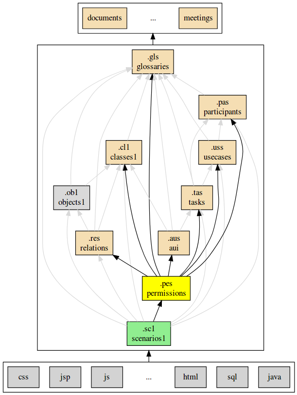

.. .. coding=utf-8

.. highlight:: PermissionScript

.. index::  ! .pes, ! PermissionScript
    pair: Script ; PermissionScript

.. _PermissionScript:

PermissionScript
================

Exemples
--------

Version anglaise

::

    permission model CyberCompagnie
    import class model from '../classes/classes.cl1'
    import usecase model from '../usecase/usecase.uss'

    EmbaucherUnEmploye can create Employe, EstEmployeeDans
    EmbaucherUnEmploye can create, update Compagnie.budget, Compagnie.quota
    LicencierUnEmploye can delete Employe
    Responsable, Secretaire can R Employee.salaire
    Directeur can read, update Employee.salaire

Version française

::

    permission model CyberCompagnie
    import class model from '../classes/classes.cl1'
    import usecase model from '../usecase/usecase.uss'

    EmbaucherUnEmploye peut créer Employe, EstEmployeeDans
    EmbaucherUnEmploye peut lire, modifier Compagnie.budget, Compagnie.quota
    LicencierUnEmploye peut détruire Employe
    Responsable, Secretaire peut L Employee.salary
    Directeur peut lire, modifier Employee.salary

..  note::

    * ``can`` peut être remplacé par ``peut``.
    * Les actions peuvent être abbréviées ou pas ("C" ou "create").
    * Les actions peuvent être traduites. Voir la section actions_.

Concepts
--------

Conceptuellement le modèle de permissions est basé sur une suite de
triplets : ::

    (sujets, actions, ressources)

Ce triplet signifie : " *les <sujets> peuvent effectuer les
<actions> sur les <ressources>.*"

Exemple : ::

    EmbaucherUnEmploye peut LM Compagnie.budget, Compagnie.quota

``EmbaucherUnEmploye`` est le sujet_. ``L`` et ``M`` sont les
actions_. ``Compagnie.budget``, ``Compagnie.quota`` sont les ressources_.
Le triplet signifie : "*le cas d'utilisation* ``EmbaucherUnEmploye``
*peut lire et modifier les attributs* ``budget`` *et* ``quota``
*de la classe* ``Compagnie``".

..  _sujet:

Sujets
------

Un **sujet** est soit:

*   un **acteur** (provenant du
    :ref:`modèle de participants<ParticipantScript>`),
    par exemple ``Directeur``,

*   un **cas d'utilisation** (provenant du
    :ref:`modèle de cas d'utilisation<UsecaseScript>`),
    par exemple ``CreerUnDepartement``.

..  commentaire LA REGLE DE TRANSITIVITE DOIT ETRE REVUE
    ELLE EST ICI A L'ENVERS

    Si un **acteur** peut réaliser une action sur une ressource_ alors
    tous les cas d'utilisation associés à cet acteur peuvent réaliser cette
    action.

    Exemple : ::

        -- Directeur peut CreerUnDepartement   (vient du modèle de cas d utilisation)
        -- Directeur peut AugmenterUnEmploye   (vient du modèle de cas d utilisation)

        Directeur peut modifier Employe.salaire           (modèle de permission)

    Dans cet exemple les deux cas d'utilisation ``CreerUnDepartement``
    et ``AugmenterUnEmploye`` peuvent modifier l'attribut ``salaire`` de la
    classe ``Employee``.

Actions
-------
..  commentaire LA REGLE DE TRANSITIVITE DOIT ETRE RE

Les actions correspondent essentiellement au modèle CRUD (voir wikipedia_).
Les actions peuvent être écrites en entier ou sous forme abbréviées,
en anglais ou en français.

================= =====================
En anglais        En français
================= =====================
C / create        C / créer
R / read          L / lire
U / update        M / modifier
D / delete        D / détruire
X / execute       X / exécuter
================= =====================

La signification des opérations dépend des ressources. Voir la section
ressources_.

.. _ressource:

Ressources
----------

Pour un modèle de classe une **ressource** est soit :

* une **classe**, par exemple ``Employe``,
* un **attribut**, par exemple ``Employe.salaire``,
* une **opération**, par exemple ``Employe.augmenter()``.
* une **association**, par exemple ``EstAffecteA``,
* une **role**, par exemple ``Employe.responsable``.

Le type de ressources définit les actions autorisées :

*   l'opération **create**/**créer** s'applique à une classe ou à une association.
    Par exemple ``créer Employe`` ou ``créer EstEmployePar``. Créer un
    attribut, un role ou une opération ne fait pas de sens.

*   l'operation **read**/**lire** s'applique à un attribut ou à un role. Par
    exemple ``lire Employe.salaire`` ou ``lire Employe.responsable``.

    *   Lorsque cette action est associée à une classe (par exemple
        ``lire Employe`` alors n'importe quel attribut
        de la classe peut être lu (dans l'exemple l'accès est donné
        à tous les attributs de la classe ``Employe``).
    *   Lorsque cette action est associée à une association (par exemple
        ``lire EstEmployePar``), alors celle-ci peut être traversée dans
        n'importe quel sens.

*   l'opération **update**/**modifie** s'applique à un attribut
    (ou à une classe, de manière analogue à **read**/**lire**).

*   l'opération **delete**/**détruire** s'applique à une classe ou à association

*   l'opératop, **execute**/**exécuter** s'applique à une operation uniquement.

============  ======== ========= ========= =========== =====
action/resc.  classe   attribut  operation association role
============  ======== ========= ========= =========== =====
create           X                              X
read            [X]        X                             X
update          [X]        X
delete           X                              X
execute                              X
============  ======== ========= ========= =========== =====

..  _PermissionScript_Methode:

Méthode
-------

Les tâches listées par la suite ne peuvent que difficilement être réalisées
en séquentiel. Cependant plusieurs pratiques existent, selon que l'on
part d'un modèle ou d'un autre.

..  _PermissionScript_ClassesEnPremier:

Classes en premier
''''''''''''''''''

Dans la méthode "classes en premier" il s'agit de partir d'un modèle de
classes, de lister chaque classes, attributs et associations, et dans
chaque cas de répondre à la question *"qui change telle ou telle ressource ?"*.
Le résultat pourrait être comme ci-dessous (résultats "triés" par la
deuxième colonne) : ::

           ...  peut C Departement
           ...  peut L Departement.budget
           ...  peut M Departement.budget
           ...  peut D Departement
           ...
           ...  peut C Projet

Cette méthode permet de vérifier que toutes les parties du modèle de classes
(à droite) sont utilisées "correctement".

Participants en premier
'''''''''''''''''''''''

Considèrer le modèle de participants en premier revient à répondre à la
question *"que peut faire tel ou tel acteur ?"* : ::

    Directeur peut C ...
    Directeur peut R ...
    Directeur peut U ...
    Directeur peut D ...
    Secretaire peut C ...
    Secretaire ...
    ...

Cette méthode permet de visualiser rapidemment les permissions associées
à chaque acteur. Par contre le détail des cas d'utilisation est manquant.

..  _PermissionScript_CasDUtilisationEnPremier:

Cas d'utilisation en premier
''''''''''''''''''''''''''''

Partir des "cas d'utilisation en premier" revient à répondre à
la question *"que peut faire tel ou tel cas d'utilisation ?"* : ::

    ReserverUneSalle peut C ...
    ReserverUneSalle peut R ...
    ReserverUneSalle peut U ...
    ReserverUneSalle peut D ...
    AugmenterUnEmploye peut C ...
    AugmenterUnEmploye ...
    ...

Matrice
'''''''

Les différentes techniques ci-dessus peuvent être combinées en
produisant d'abord une matrice listant d'un coté toutes les resources
(classes, etc.) et de l'autre tous les sujets (acteurs, etc.).
Il s'agit ensuite de répondre pour chaque élément de la matrice à la
question *"quelles actions peut être réalisées par ce sujet sur cette
ressource"*.

Dépendances
-----------

Le graphe ci-dessous montre les dépendances entre langages.

..  _wikipedia:
    https://en.wikipedia.org/wiki/Create,_read,_update_and_delete