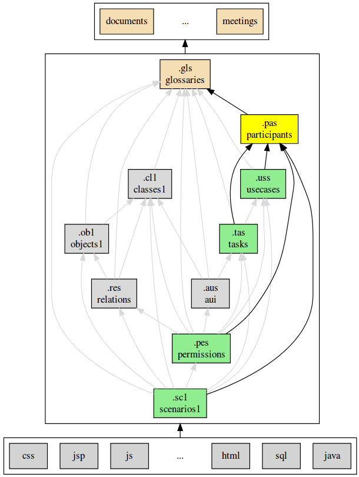

.. .. coding=utf-8

.. .. highlight:: ParticipantScript

.. index::  ! .pas, ! ParticipantScript
    pair: Script ; ParticipantScript

.. _ParticipantScript:

ParticipantScript
=================

Examples
--------

::

    participant model Demo

    actor Cashier
        | The documentation

    actor Client

    actor SpecialClient < Client

    stakeholder StoreManager
        | StoreManagers want the cash machine to
        | collect the exact amount of money and
        | to store safely this money.

    team role Developer
        | A developer is responsible to develop and maintain
        | some software components.

    team role QualityManager
        | The QualityManager is responsible to ensure that the
        | quality of the product stays in line with quality
        | requirements.

    team role CodeQualityManager < QualityManager
        | A CodeQualityManager do something with code.

    team role ScrumMaster
        | A scrum master is a facilitator in the context of
        | a `ScrumTeam`.

    team role ProductOwner

    person marieDupont : Developer, QualityManager
        name : "Marie Dupont Laurent"
        trigram : MDL
        portrait : './mdupont.png'
        attitudes
        aptitudes
            age : 12
        skills
        motivations
        | trigram: MSI
        | blabla blabla

    persona marco : Cashier, Client
        name : "Marco Gonzales"
        trigram : MGS
        | Marco is 45 years old.
        | He is used to computers and phones.
        | Some more description about marco
        attitudes
            | marco likes playing football.
            | He also loves eating pizza and playing with this
            | damned computer system.
        aptitudes
            education
                | master software engineering (1992)
                | PhD in medio chemicals (1999)
            languages
                | english (fluent)
                | spanish (novice)
            age : 45
            disabilities : "blind"
            learning ability : low
            | Marco is kind to learn but he also knows already
            | very much.
        motivations
            why
                | Marco is really reluctant to use the system.
                | Her boss, anna, told him that he will be fired
                | if he do not get good results.
            level : low
            kind : obliged
            | Some additional remark or documentation
        skills
            | Marco is an expert in playing with the mouse.
            level : novice
            culture
                | occidental
            modalities
                "labtop" : expert
                "smartphone" : novice
                "iPhone 10.3" : expert
            environments
                "Ubuntu" : expert
                "Windows" : intermediate
                "Android 18.5" : novice

    adhoc persona jean : Cashier, Client
        | Jean is 50 years old.
        | He is used to computers and phones software.

ParticipantScript
-----------------

The participant model aims to define all kinds of participants involved
somehow in the software project. This could be either because they
will *use* the system or because they are implicated in its design.

Concepts
--------

* actors
* stakeholders
* team role
* person
* persona

Actors
------

The notion of actor come directly from UML use case model.
Simply put, an actor is basicaly a role played by a category of person
or system. An actor is
basic

Stakeholder
-----------

Team role
---------

Person
------

Persona
-------

Dependencies
------------

The graph below show all language depdencies.

..  _`usecase diagrams`: https://www.uml-diagrams.org/use-case-diagrams.html