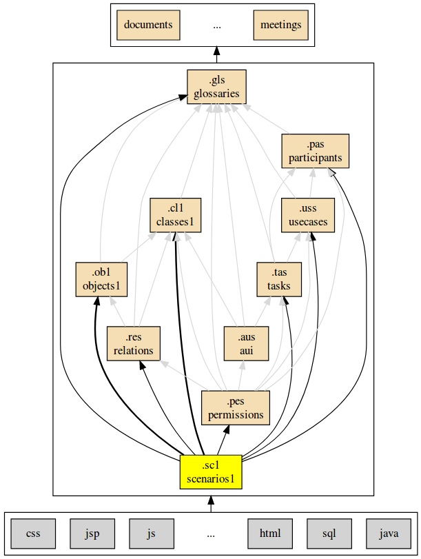

.. .. coding=utf-8

.. highlight:: ScenarioScript1

.. index::  ! .sc1, ! ScenarioScript1
    pair: Script ; ScenarioScript1

.. _ScenarioScript1:

ScenarioScript1
===============

Examples
--------

Examples
--------

..  code-block:: ScenarioScript1
   :linenos:

    --@ scenario model SC1
    --@ import glossary model from "../../glossaries/glossary.gls"
    --@ import class model from "../../classes/classes.cls"
    --@ import participant model from "../../participants.pas"
    --@ import usecase model from "../../usecases/usecases.uss"

    -- TODO: corriger les erreurs et completer la suite

    --@ context
        ! open -q "."
    --| (1) Nourry Blanc est professeur de musique.
        ! create nourry : Enseignant
        ! nourry.nom := 'Nourry Blanc'
        ! nourry.matiere := 'musique'
        ! nourry.login := Undefined
        ! nourry.motDePasse := Undefined

    --@ usecase nourry CreerUnAtelier
    --| (2) Il décide de réaliser en terminale S876 un atelier "Tolerance !".
        ! create s876 : Classe
        ! s876.code := 'S876'
        ! create atTolerance : Atelier
        ! atTolerance.titre := 'Tolerance !'
        ! insert (nourry, atTolerance) into Realise
        --@ insert
    --| (3) Cet atelier aura lieu du 23/11/2019 au 27/11/2019.
    --| (4) Cet atelier sera basé sur l'album "All is 1".

    -- (5) Il y a 20 exemplaires à la bibliothèque "Mandela/Paris".

ScenarioScript1
---------------

Tooling
-------

Analyzing models
''''''''''''''''

The conformity of scenario models with class models can be checked with
the `USE OCL`_ tool. Analyzing scenario models is just like
:ref:`analyzing object models<AnalyzingObjectModels>`.

Generating models
'''''''''''''''''

It is possible to generate an object diagram representing the state at
the end of the scenario. Creating such object diagrams is possible.
Check how to :ref:`generate object diagram<GeneratingObjectDiagrams>`.

Concepts
--------

ScenarioScript1 models are based on the following concepts:

Dependencies
------------

The graph below show all language depdencies.

..  _`USE OCL`: http://sourceforge.net/projects/useocl/
