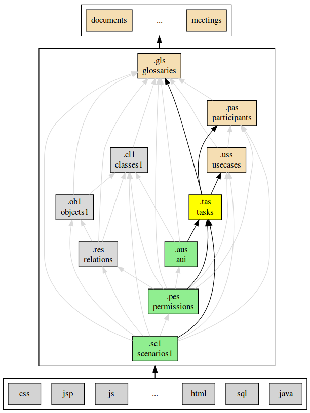

.. .. coding=utf-8

.. highlight:: TaskScript

.. index::  ! TaskScript
    pair: Script ; TaskScript

.. _TaskScript:

TaskScript
==========

*Tasks models* exist in the form of *task diagrams* created and managed using
the Kmade_ tool. By contrast to other languages, no textual notation is
available for *task models*.

.. figure:: media/KMADE-task-model.jpg

    *task model* by `Sybille Caffiau <http://iihm.imag.fr/en/member/caffiau/>`__

For more information about Kmade_ see the `Kmade user manual`_.

Note that the integration between Kmade_ and ModelScript is achieved via
the XML representation of Kmade_ model.

..  _Kmade: https://forge.lias-lab.fr/projects/kmade

..  _`Kmade user manual`: https://forge.lias-lab.fr/attachments/download/4/KMADe-1.0-UserManual-FR.pdf

Dependencies
------------

The graph below show all language depdencies.

